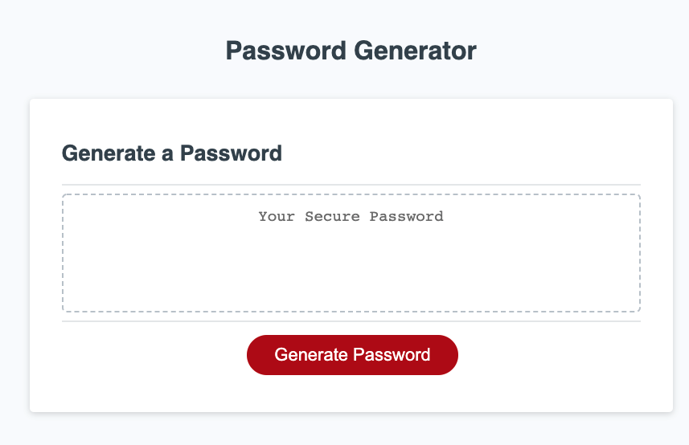

# PASSWORD-GENERATOR-HAYDENHAUN

REPO URL: https://github.com/Hayden-Haun/PASSWORD-GENERATOR-HAYDENHAUN

LIVE APPLICATION URL: https://hayden-haun.github.io/PASSWORD-GENERATOR-HAYDENHAUN/

ABOUT:

THIS PROGRAM WILL GENERATE A PASSWORD BASED ON USER SELECTIONS.
THE USER SELECTS THE NUMBER OF CHARACTERS IN PASSWORD, AND FOUR ADDITIONAL OPTIONS: SPECIAL CHARACTERS, NUMBERS, UPPER CASE & LOWER CASE LETTERS.

IF THE USER DOES NOT SELECT A VALID LENGTH, THE APPLICATION WILL KEEP PROMPTING UNTIL A VALID LENGTH IS SELECTED

IF THE USER DOES NOT SELECT "YES" TO THE FOUR OPTIONS, AN ALERT WILL BE SHOWN TO TELL THE USER TO MAKE AT LEAST ONE SELECTION AND PRESS THE BUTTON AGAIN.

TECHNOLOGIES USED: HTML, CSS, JAVASCRIPT, jQUERY

